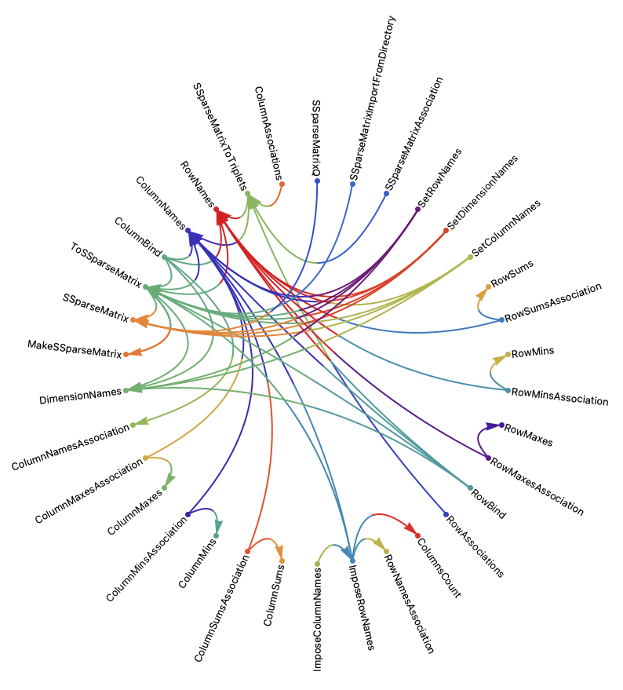

# CallGraph WL paclet

## Introduction

This Wolfram Language (aka Mathematica) paclet provides functions for making a call graph between
the functions that belong to specified contexts.

The main function is `CallGraph` that gives a graph with vertices that are functions names and edges that show
which functions call which other functions. With the default option values the graph vertices are labeled and
have tooltips with function usage messages.

------

## General design

The call graphs produced by the main package function `CallGraph` are assumed to be used for studying or refactoring
of large code bases written with Mathematica / Wolfram Language.

The argument of `CallGraph` is a context string or a list of context strings.

With the default values of its options `CallGraph` produces a graph with labeled nodes and the labels have tooltips
that show the usage messages of the functions from the specified contexts.
It is assumed that this would be the most useful call graph type for studying the codes of different sets of packages.

We can make simple, non-label, non-tooltip call graph using `CallGraph[ ... , "UsageTooltips" -> False ]`.

The simple call graph can be modified with the functions:

      CallGraphAddUsageMessages, CallGraphAddPrintDefinitionsButtons, CallGraphBiColorCircularEmbedding

Each of those functions is decorating the simple graph in a particular way.

------

## Usage examples

This installs and loads the paclet:

    PacletInstall["AntonAntonov/CallGraph"]
    Needs["AntonAntonov`CallGraph`"]

This installs and loads a paclet to analyse:

    PacletInstall["AntonAntonov/SSparseMatrix"]
    Needs["AntonAntonov`SSparseMatrix`"]
      
### Generate a call graph with usage tooltips

      CallGraph["AntonAntonov`SSparseMatrix`", GraphLayout -> "SpringElectricalEmbedding", ImageSize -> Large]

### Generate a call graph with exclusions

      gr =
        CallGraph["AntonAntonov`SSparseMatrix`",
                  Exclusions -> {QRMonUnit, QRMon, QRMonBind, $QRMonFailure, ToExpression /@ Names["QRMonTake*"], ToExpression /@ Names["QRMonSet*"]},
                  GraphLayout -> "SpringEmbedding", ImageSize -> Large]

### Generate call graph with buttons to print definitions

      gr0 = CallGraph["AntonAntonov`SSparseMatrix`", "UsageTooltips" -> False];
      gr1 = CallGraphAddPrintDefinitionsButtons[gr0, GraphLayout -> "StarEmbedding", ImageSize -> 900]

### Generate circular embedding graph with colored edges

      cols = RandomSample[ ColorData["Rainbow"] /@ Rescale[Range[VertexCount[gr1]]]];

      CallGraphBiColorCircularEmbedding[ gr1, "VertexColors" -> cols, ImageSize -> 900 ]

## Options

The package functions "CallGraph*" take all of the options of the function Graph.
Below are described the additional options of CallGraph.

- "PrivateContexts"
  Should the functions of the private contexts be included in the call graph.

- "SelfReferencing"
  Should the self referencing edges be excluded or not.

- "AtomicSymbols"
  Should atomic symbols be included in the call graph.

- Exclusions
  Symbols to be excluded from the call graph.

- "UsageTooltips"
  Should vertex labels with the usage tooltips be added.

- "UsageTooltipsStyle"
  The style of the usage tooltips.

## Possible issues

- With large context (e.g. "System`") the call graph generation might take long time. (See the TODOs below.)

- With "PrivateContexts"->False the call graph will be empty if the public functions do not depend on each other.

- For certain packages the scanning of the down values would produce (multiple) error messages or warnings.

Anton Antonov
Windermere, Florida, USA
2019-01-01
2023-05-20